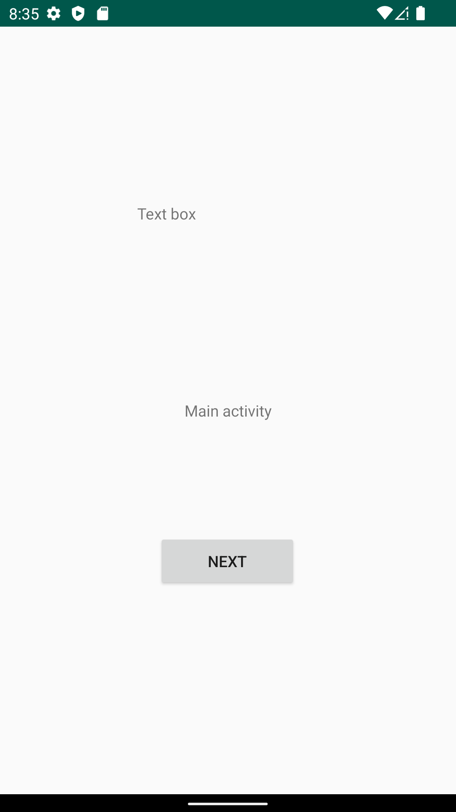
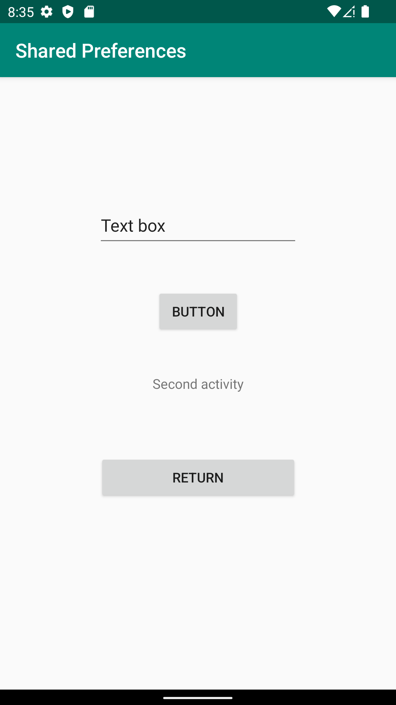
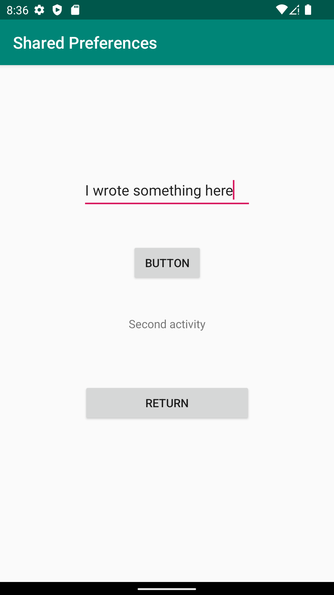
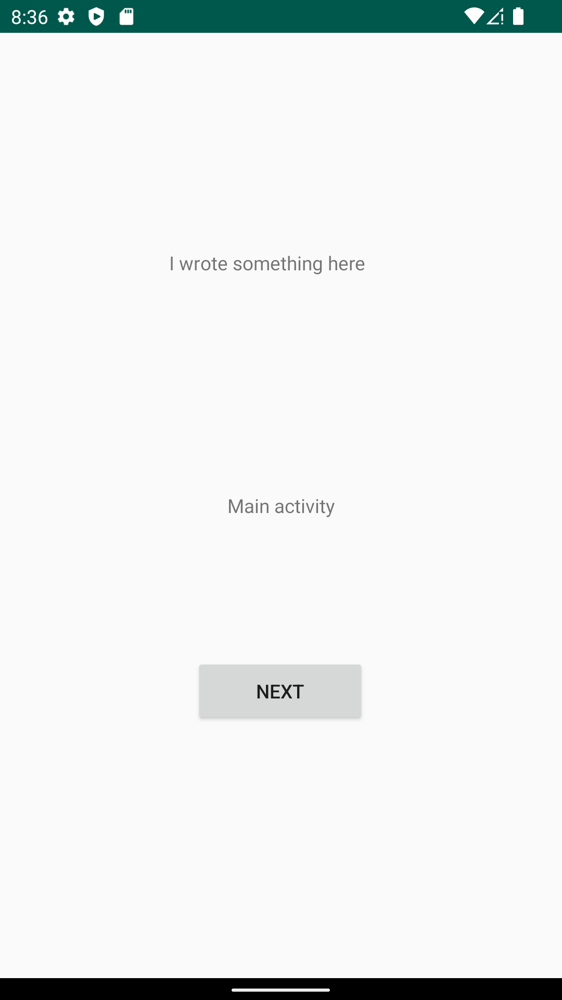

# Rapport

This project started with the creation of the two activities and their components.
Then a simple code for jumping between the activities was made

```
 openActivity2(); // calling openActivity2 function
 
```
 
```
 public void openActivity2(){
        Intent intent = new Intent(this, SecondActivity.class);
        startActivity(intent);
    }


```

Lastly a text box was made in the second activity that will transfer its edited text to a text view in the first activity.
A button was link to the text box to save the edit.

When the return button is pressed the onResume code will run and update the text view in main activity to match the edited text box.

```
public void onResume() {
        super.onResume();
        SharedPreferences sp = getApplicationContext().getSharedPreferences("MyPrefs", Context.MODE_PRIVATE);

        TextView t1;
        t1 = findViewById(R.id.textThatGotEditThing);
        t1.setText(sp.getString("TextEdit","idk"));


```


Main activity no edit.


Second activity no edit.


Second activity new edit.


Main activity edited.



